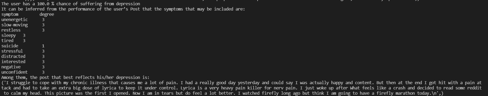

### 一、项目方案

#### 项目流程：

#### 知识图谱结构:

#### 文本特征模型抽取方法:

### 二、 项目结果

#### 知识图谱构建(D:抑郁症患者，C：普通用户，A：全体用户)：

| 类别     | 症状        | 词数 | 平均词频D | 平均词频C | 平均词频A | 平均得分D | 平均得分C | 平均得分A |
| -------- | ----------- | ---- | --------- | --------- | --------- | --------- | --------- | --------- |
| 身体信息 | unenergetic | 45   | 21.18     | 5.35      | 6.57      | 10.76     | 2.56      | 3.19      |
| 身体信息 | slow-moving | 49   | 33.46     | 12.06     | 13.71     | 23.77     | 8.74      | 9.89      |
| 身体信息 | restless    | 41   | 16.38     | 5.03      | 5.9       | 7.07      | 2.24      | 2.61      |
| 身体信息 | sleepy      | 25   | 25.17     | 8.97      | 10.21     | 13.59     | 5.26      | 5.59      |
| 身体信息 | tired       | 39   | 44.41     | 11.85     | 14.36     | 25.92     | 6.61      | 8.09      |
| 个人经历 | suicide     | 7    | 3.53      | 0.47      | 0.71      | 3.52      | 0.46      | 0.71      |
| 个人经历 | stressful   | 36   | 47.62     | 13.18     | 15.84     | 26.86     | 7.09      | 8.61      |
| 情绪表达 | distracted  | 9    | 1.89      | 0.31      | 0.43      | 1.49      | 0.25      | 0.34      |
| 情绪表达 | interested  | 41   | 104.21    | 30.08     | 35.79     | 61.14     | 18.71     | 21.98     |
| 情绪表达 | negative    | 100  | 4.44      | 2.21      | 2.38      | 4.44      | 2.21      | 2.38      |
| 情绪表达 | unconfident | 18   | 12.11     | 2.18      | 2.94      | 7.93      | 1.4       | 1.91      |

#### 训练结果：

| Con:Dep(train) | Con:Dep(val) | Feature Dim | Predictor     | ACC    | F1 Score    | Recall      | Precision   | AUC    |
| -------------- | ------------ | ----------- | ------------- | ------ | ----------- | ----------- | ----------- | ------ |
| 10:1           | 10:1         | 8           | attention+CNN | 0.9247 | 0.9125      | 0.7023      | 0.6873      | 0.6894 |
| 1:1            | 10:1         | 8           | attention+CNN | 0.85   | 0.87 / 0.71 | 0.85 / 0.65 | 0.90 / 0.73 | 0.7939 |
| 1:1            | 1:1          | 8           | attention+CNN | 0.75   | 0.76        | 0.77        | 0.76        | 0.7782 |
| 1:1            | 1:1          | 12          | attention+CNN | 0.78   | 0.78        | 0.78        | 0.78        | 0.7931 |
| 1:1            | 1:1          | 44          | attention+CNN | 0.78   | 0.77        | 0.78        | 0.77        | 0.7864 |
| 10:1           | 10:1         | 44          | attention+CNN | 0.87   | 0.89/0.68   | 0.87/0.77   | 0.92/0.65   | 0.8100 |

**解释性预测：**

针对每一项图谱中的内容设定0，1，2，3三个指标表示程度

**训练图：**

LOSS：

Performance:

